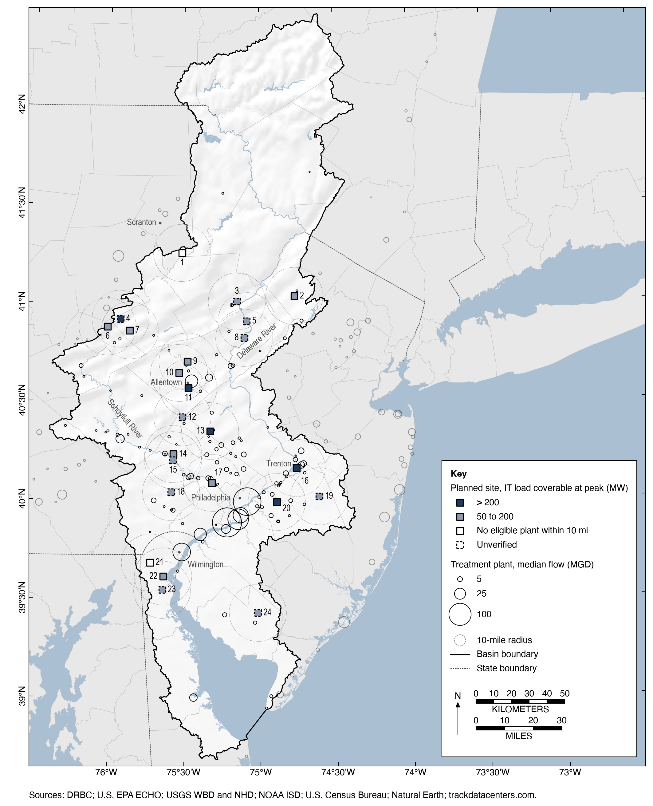

# PeakFlow: Probabilistic Peak-Demand Modeling for Data Center Water Policy in the Delaware River Basin

PeakFlow is an open model and geospatial screen that estimates peak-day cooling water demand for planned data centers in the Delaware River Basin, matches each site to nearby municipal effluent, and derives enforceable water terms for community benefit agreements. Authors: Ronith Lahoti and Veronica Guo, University of Pennsylvania.

## Findings

Of the 24 active planned data center sites in the Delaware River Basin, 22 lie within 10 miles of an eligible municipal treatment plant whose median effluent flow could supply cooling water [trackdatacenters_2026, epa_echo, peakflow_model]. Whether that plant also covers a site's own peak day depends on the capacity assumed for the 16 sites that publish none: the count falls from 15 to 5 as their assumed IT load rises from 50 to 200 MW [epa_echo, peakflow_model]. Under Monte Carlo uncertainty, the nearest plant covers the 90th-percentile peak day at 1 of 24 sites, or 6 of 24 if unstated sites are held at 100 MW [peakflow_model, shehabi_2024]. Delaware River Basin Commission review is a weak check on this demand. The 30-day averaging rule hides peak-day demand only for calibrated hybrid designs of 7.53 to 23.6 MW of IT load, but a facility that buys water from a public or authority system needs no review at any size [peakflow_model, drbc_admin_manual, drbc_datacenters_2026]. All 24 sites would be reviewed if self-supplied, yet 7 are reported to purchase from a public or authority system, 2 are self-supplied and 15 have no published supplier [peakflow_model]. The Falls Township campus shows the gap: its reported cooling demand averages 135,000 gal/day with a peak day of 4.4 million gal/day, above the 100,000 gal/day trigger, and it required no review because the Morrisville Municipal Authority supplies it [falls_levittown_2026, falls_herald_2026, drbc_admin_manual].

## Our Supply screen map



**Figure 1.** The map we developed shows the 24 active planned data center sites in the Delaware River Basin and the municipal wastewater treatment plants whose effluent could supply their cooling water [trackdatacenters_2026, epa_echo, peakflow_model]. The full caption is in figures/supply_screen_map_caption.md. The site key is in figures/site_key.csv. The plotted values are in figures/supply_screen_map_data.csv. An interactive version with Esri background tiles is figures/supply_screen_map.html [esri_light_gray].

## Regulatory blind spot

| Configuration | Max 30-day average (gal/d) | Peak day (gal/d) | DRBC review if self-supplied | DRBC review if purchased |
|:--|--:|--:|:-:|:-:|
| Falls Twp (AWS Keystone), reported | 1,410,000¹ | 4,400,000⁴ | Yes | No |
| Hybrid (calibrated), 15 MW | 63,700¹ | 199,000¹ | No | No |
| Hybrid (calibrated), 100 MW | 424,000 | 1,330,000 | Yes | No |
| Hybrid (calibrated), 400 MW | 1,700,000 | 5,310,000 | Yes | No |
| Evaporative tower, 100 MW | 1,500,000 | 1,500,000 | Yes | No |
| Air-cooled chiller, 100 MW | 0 | 0 | No | No |

Rows and cells are copied from results/table_blindspot_brief.csv. Except for the 15 MW hybrid row, they come from results/table_blindspot.csv under the primary calibration [peakflow_model]. The 15 MW row is the 100 MW hybrid scaled linearly, because makeup is proportional to IT load [peakflow_model]. It lies inside the averaging band of 7.53 to 23.6 MW [peakflow_model]. Superscript 1 marks a model-derived value at PUE 1.2 and 4 cycles of concentration on Trenton hourly wet-bulb temperature for 2005 to 2024 [peakflow_model, shehabi_2024, noaa_isd, stull_2011]. Superscript 4 marks a reported value [falls_levittown_2026, falls_herald_2026]. Unmarked hybrid, tower and chiller values are also model-derived [peakflow_model]. The review trigger is a daily average gross withdrawal above 100,000 gallons over any 30 consecutive days [drbc_admin_manual]. A project that buys water from an existing public or authority system is not itself reviewed [drbc_datacenters_2026].

## Key numbers

The items below are copied verbatim from results/brief_numbers.md.

1. The study maps 24 active planned sites in the Delaware River Basin, matching the Commission's total of 24 [trackdatacenters_2026, drbc_khalil_2026]. Of these, 17 are in Pennsylvania, 4 in New Jersey and 3 in Delaware, against the Commission's 18, 3 and 3 [trackdatacenters_2026, drbc_khalil_2026].
2. At Falls Township, documented potable demand is 19,000 gal/day and reported cooling demand averages 135,000 gal/day [falls_herald_2026, falls_levittown_2026, peakflow_model]. The reported peak day is 4.4 million gal/day, 32.6 times the average [falls_herald_2026, falls_levittown_2026, peakflow_model].
3. The Commission's 30-day average trigger hides peak-day demand only for hybrid designs of 7.53 to 23.6 MW of IT load [peakflow_model, drbc_admin_manual, drbc_datacenters_2026]. A facility that buys from a public or authority system needs no review at any size [peakflow_model, drbc_admin_manual, drbc_datacenters_2026].
4. All 24 sites would be reviewed if self-supplied [peakflow_model]. Of these, 7 are reported to purchase from a public or authority system, 2 are self-supplied and 15 have no published supplier [peakflow_model].
5. Of the 24 sites, 22 lie within 10 miles of an eligible municipal treatment plant [epa_echo, peakflow_model]. The number whose plant covers the site's own peak day ranges from 15 to 5 as the assumed load of the 16 unstated sites rises from 50 to 200 MW [epa_echo, peakflow_model].
6. The Falls targets imply an IT load of 331 MW, above the unverified figure of 253 MW [peakflow_model, cleanview_keystone_2026].
7. With literature effluent quality, 12 of 19 matched plants allow fewer cooling-tower cycles than the model's 4, mostly because of phosphate [peakflow_model, vidic_2009, geiger_1993]. All allow 4.6 to 7.0 without that limit [peakflow_model, vidic_2009, geiger_1993].
8. The nearest plant covers the 90th-percentile peak day at 1 of 24 sites, or 6 of 24 if unstated sites are held at 100 MW [peakflow_model, shehabi_2024].
9. An air-cooled chiller avoids evaporative water use but needs 5.51 million kWh per MW-year more non-IT energy than the calibrated hybrid [shehabi_2024, peakflow_model].

## Methods

### Weather and wet-bulb temperature

Hourly observations for Trenton Mercer Airport (KTTN, station 72409514792) and Philadelphia International (KPHL, station 72408013739) come from the NOAA Integrated Surface Database global-hourly files [noaa_isd]. The analysis window is the 20 complete calendar years 2005 to 2024 [noaa_isd, peakflow_model]. The year 2025 was downloaded for provenance, but it was excluded because the files were incomplete at download time [noaa_isd, peakflow_model]. One whole report is kept per clock hour. The selection prefers reports with valid temperature and dew point, then routine METAR reports over special reports. Values with failing quality codes or missing sentinels are set to missing without interpolation [peakflow_model]. Relative humidity is derived from temperature and dew point with the Magnus form of saturation vapor pressure [alduchov_1996]. Wet-bulb temperature follows Stull [stull_2011]. The fit is valid for relative humidity of 5 to 99 percent and air temperature of minus 20 to 50 °C, with a mean absolute error below 0.3 °C [stull_2011]. Station pressure is not used, consistent with the Stull method [stull_2011]. Trenton weather drives every site [noaa_isd, peakflow_model].

### Cooling model and calibration

Heat rejected to the cooling system is approximated by total facility power. Total facility power equals the IT load times a power usage effectiveness (PUE) of 1.2 [shehabi_2024, peakflow_model]. Evaporation removes 2.43 MJ/kg of latent heat [peakflow_model]. Drift is neglected. Makeup equals evaporation times C/(C - 1), where C is cycles of concentration, fixed at 4 [peakflow_model]. Three architectures are modeled [peakflow_model]. An evaporative tower rejects all heat evaporatively in every hour. An air-cooled chiller has zero evaporative makeup. A hybrid architecture runs dry below a switchover wet-bulb temperature. Above that temperature, it raises its evaporative fraction along a part-load curve with exponent gamma. Water use effectiveness follows the Green Grid definition of annual site water per unit of IT energy [greengrid_wue_2011].

The hybrid is calibrated to the Falls Township filing: an annual average cooling demand of 135,000 gal/day, a peak day of 4.4 million gal/day and water cooling in 6 percent of annual hours [falls_levittown_2026, falls_herald_2026]. The separate potable demand of 19,000 gal/day is not used in the fit [falls_levittown_2026]. The primary fit reads the peak as the largest calendar-day makeup and gives a switchover wet-bulb temperature of 22.4 °C, a part-load exponent of 0.429 and 331 MW of IT load [peakflow_model, noaa_isd, stull_2011]. Reading it as the maximum hourly rate over a full day gives 293 MW and 0.355 as a sensitivity [peakflow_model, noaa_isd, stull_2011]. Three parameters are fitted to three targets, so the fit is exactly determined and its near-zero residuals are not validation [peakflow_model]. An unverified 253 MW figure is carried only as a sensitivity [cleanview_keystone_2026]. The calibrated hybrid gives 13,286 gal/day of peak-day makeup per MW of IT load [peakflow_model].

### Blind-spot test

Daily makeup is summed on local calendar days, and days with fewer than 20 valid hours are missing [peakflow_model]. The trailing 30-day average is computed when at least 27 of the 30 days are valid, and a configuration is below the review trigger when its maximum 30-day average does not exceed 100,000 gal/day [peakflow_model, drbc_admin_manual]. The averaging blind spot is a configuration below the trigger on every 30-day average that still exceeds 100,000 gal on a peak day [drbc_admin_manual, drbc_datacenters_2026]. The purchased-supply blind spot applies to any project that buys from a public or authority system [drbc_admin_manual, drbc_datacenters_2026]. The grid is 50, 100, 200 and 400 MW of IT load for each of the three architectures, 12 configurations in all, with makeup treated as gross withdrawal [peakflow_model]. Peak days are set against Delaware River flow at Trenton (USGS 01463500), its 2005 to 2024 day-of-year 25th percentile and a log-Pearson Type III 7Q10 of 1,795 cfs [usgs_nwis_01463500, peakflow_model].

### Supply screen

Plant candidates are NPDES major permittees in Pennsylvania, New Jersey, Delaware and New York from EPA ECHO [epa_echo]. Eligible plants are municipal major dischargers with at least 12 months of flow reports from July 2023 to June 2026 [epa_echo, peakflow_model]. Supply is the median monthly flow of the nearest eligible plant within 10 miles, measured in an equal-area projection [epa_echo, peakflow_model]. Plants on either side of the basin divide are eligible [peakflow_model]. A site is matchable when that plant's median flow covers its peak-day makeup [peakflow_model]. A site is partial when an eligible plant is within 10 miles but its flow falls short [peakflow_model]. A site is classed as having no match when no eligible plant is within 10 miles [peakflow_model]. Stated campus power is divided by 1.2 to give IT load [peakflow_model]. Sites without a stated capacity are assigned 100 MW, with 50 and 200 MW as sensitivities [peakflow_model]. A further sensitivity admits industrial dischargers [peakflow_model]. The basin is the union of hydrologic units 020401 and 020402 [usgs_wbd].

### Supplier classification

The supplier table data/sites/site_suppliers.csv is compiled by hand from published sources for the 24 active sites [peakflow_model]. Each site is classed as public or authority supply, self-supplied or unknown, with a confidence of stated in source, inferred from service area, or none [peakflow_model]. Seven sites are public or authority supply, 2 are self-supplied and 15 are unknown [peakflow_model]. The per-site sources are listed in results/results.md and sources.md.

### Monte Carlo uncertainty

The Monte Carlo analysis uses 10,000 draws with seed 20260925 [peakflow_model]. Cooling architecture is drawn from LBNL's 2023 hyperscale cooling-system shares, grouped into evaporative tower 0.016, hybrid 0.914 and air-cooled chiller 0.070 [shehabi_2024]. Annual site water use effectiveness is drawn from LBNL's large-scale simulated ranges, 1.72 to 2.78 L/kWh for the waterside economizer and 0 to 1.56 L/kWh for the airside economizer with adiabatic cooling, and PUE is uniform on 1.15 to 1.35 [shehabi_2024]. Annual values are converted to a peak day with the calibrated maximum-day to mean-day ratio, 1.0 for the evaporative tower and 32.6 for the hybrid, and hybrid days are capped at full evaporation [peakflow_model]. The cap binds in 92 percent of hybrid draws [peakflow_model]. The 16 sites without a stated capacity draw their IT load from the 8 stated values, 242 to 1,250 MW [trackdatacenters_2026, peakflow_model]. For Falls Township, 2,000 draws of IT load, PUE and part-load exponent, each over one randomly chosen weather year, give a median annual maximum day of 2.88 million gal/day [peakflow_model, cleanview_keystone_2026, shehabi_2024, noaa_isd].

### Water and energy

Water per MW-year of IT load comes from the cooling model on Trenton weather. Non-IT energy per MW-year is (PUE minus 1) times 8,760,000 kWh, with PUE taken from LBNL Figure 4.4 [peakflow_model, shehabi_2024]. Figure 4.4 is digitized from the report PDF at a resolution of 0.005 in PUE and 0.014 L/kWh in site water use effectiveness [peakflow_model, shehabi_2024]. The evaporative tower uses about 5,110,000 gallons per MW-year [peakflow_model, shehabi_2024]. The calibrated hybrid uses about 149,000 gallons per MW-year [peakflow_model, shehabi_2024]. The air-cooled chiller uses no evaporative makeup, at a median PUE of 1.83 [peakflow_model, shehabi_2024]. PUE minus 1 counts all non-IT energy and therefore bounds cooling energy from above [peakflow_model].

### Cycles of concentration

The cooling model fixes cycles of concentration at 4, so makeup scales as C/(C - 1) in every per-MW rate [peakflow_model]. A separate screen computes allowable cycles for each of the 19 matched plants as the minimum over silica (150 mg/L as SiO2), chloride, orthophosphate and a Langelier saturation index of 2.5 at 35 C [midkiff_1977, geiger_1993, vidic_2009, hem_1985, cycles_by_plant.csv]. Makeup quality comes from each plant's DMR where reported and from literature secondary-effluent values otherwise. The Water Quality Portal was not reachable, so every row is marked assumed [wqp_status.json]. The chloride and phosphate limits are operating levels demonstrated at one tower under an inhibitor program, not design limits [geiger_1993].

## Reproduction

Create the environment from the lock file. The lock file pins every package. Then download the data and run the pipeline.

```
conda env create -f environment.lock.yml
conda activate peakflow
make data
make all
make urls
PYTHONPATH=src python -m peakflow.fetch --verify
```

The `make data` target downloads every raw file listed in data/raw/MANIFEST.md. It ends with `fetch --verify`, which exits non-zero unless all 357 manifest rows exist with the recorded SHA-256 [peakflow_model]. The `make all` target repeats the data step idempotently, then fits the model, builds the blind-spot table, runs the supply screen and every figure target, regenerates sources.md and runs the tests. It is offline after `make data`. The `make urls` target is a live HTTP check of site source URLs. It is not part of `make all`. Its results vary by day. Run `make urls map` to refresh the check and rebuild the map. The standalone `fetch --verify` call, also available as `make verify-manifest`, confirms the raw files after any manual change. The planned-site lists in data/raw/trackdatacenters_drb.csv and trackdatacenters_drb_nearmiss.csv are supplied by hand and are not downloaded [trackdatacenters_2026]. The Makefile sets `PROJ_DATA` to the share/proj folder of the environment that runs `python`, so pyproj finds its database without activation. When running Python or pytest outside make, set it yourself with `export PROJ_DATA="$CONDA_PREFIX/share/proj"`.

In the second audit (audit/AUDIT_v2.md), a clean build from a fresh clone, including all downloads, took about 18 minutes. A rebuild from cached data takes about 1 minute.

## Repository layout

```
Makefile                 pipeline targets (data, model, table, map, urls, figures, docs, test, clean)
environment.yml          direct dependencies, pinned
environment.lock.yml     full solved environment, pinned without build strings
references.bib           citation keys (sources.md is generated from it by `make docs`)
CITATION.cff, LICENSE    citation metadata and the MIT license for the code
LICENSES.md              code license and the terms of each data source
src/peakflow/         pipeline modules: fetch, weather, wetbulb, cooling_model, calibration, wue, flow,
                         blindspot, sites, urlcheck, echo, supply_screen, suppliers, site_blindspot,
                         uncertainty, tradeoff, falls_figures, basemap, docs, styles, paths
src/peakflow/plotting/ figure code: supply_map, figures_v2, figures_v3, peak_uncertainty
tests/                   pytest suite and fixtures
data/raw/                raw downloads (ignored by git) and MANIFEST.md
data/processed/          derived tables (ignored by git except the two URL-check files)
data/sites/              planned-site list, source overrides and supplier table
data/sites/research/     research notes from the site search (not read by the pipeline, and IDs differ from DRBnn)
results/                 tables, JSON summaries, results.md, brief_numbers.md, exclusions.csv
figures/                 figures in PNG, PDF and SVG, each with a caption file and a data file
audit/                   audit specification and gap list
scratch/                 working files (ignored by git)
```

## Licenses

The code license and the terms of each data source are listed in [LICENSES.md](LICENSES.md).
