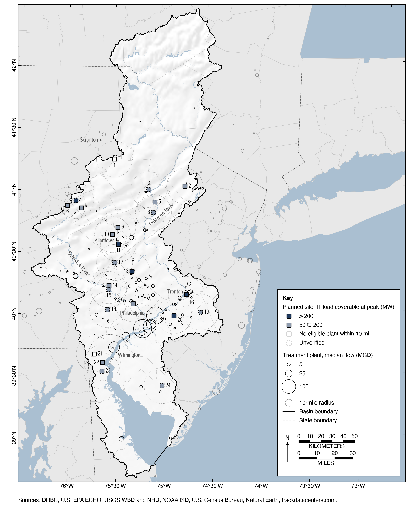

# Reuse-Ready: technical appendix

## Findings

Of the 24 active planned data center sites in the Delaware River Basin, 22 lie within 10 miles of an eligible municipal treatment plant whose median effluent flow could supply cooling water [trackdatacenters_2026; epa_echo; reuse_ready_model]. Whether that plant also covers a site's own peak day depends on the capacity assumed for the 16 sites that publish none: the count falls from 15 to 5 as their assumed IT load rises from 50 to 200 MW [epa_echo; reuse_ready_model], and under Monte Carlo uncertainty the nearest plant covers the 90th-percentile peak day at 1 of 24 sites, or 6 of 24 if unstated sites are held at 100 MW [reuse_ready_model; shehabi_2024]. Delaware River Basin Commission review is a weak check on this demand. The 30-day averaging rule hides peak-day demand only for calibrated hybrid designs of 7.53 to 23.6 MW of IT load, but a facility that buys water from a public or authority system needs no review at any size [reuse_ready_model; drbc_admin_manual; drbc_datacenters_2026]. All 24 sites would be reviewed if self-supplied, yet 7 are reported to purchase from a public or authority system, 2 are self-supplied and 15 have no published supplier [reuse_ready_model]. The Falls Township campus shows the gap: its reported cooling demand averages 135,000 gal/day with a peak day of 4.4 million gal/day, above the 100,000 gal/day trigger, and it required no review because the Morrisville Municipal Authority supplies it [falls_levittown_2026; falls_herald_2026; drbc_admin_manual].

## Supply screen map



**Figure 1.** Map showing the 24 active planned data center sites in the Delaware River Basin and the municipal wastewater treatment plants whose effluent could supply their cooling water. [trackdatacenters_2026; epa_echo; reuse_ready_model] The full caption, the site key and the plotted values are in figures/supply_screen_map_v3_caption.md, figures/site_key.csv and figures/supply_screen_map_v3_data.csv. An interactive version with Esri background tiles is figures/supply_screen_map.html [esri_light_gray].

## Regulatory blind spot

| Configuration | Max 30-day average (gal/d) | Peak day (gal/d) | DRBC review if self-supplied | DRBC review if purchased |
|:--|--:|--:|:-:|:-:|
| Falls Twp (AWS Keystone), reported | 1,410,000¹ | 4,400,000⁴ | Yes | No |
| Hybrid (calibrated), 15 MW | 63,700¹ | 199,000¹ | No | No |
| Hybrid (calibrated), 100 MW | 424,000 | 1,330,000 | Yes | No |
| Hybrid (calibrated), 400 MW | 1,700,000 | 5,310,000 | Yes | No |
| Evaporative tower, 100 MW | 1,500,000 | 1,500,000 | Yes | No |
| Air-cooled chiller, 100 MW | 0 | 0 | No | No |

Rows and cells are copied from results/table_blindspot_brief.csv. Except for the 15 MW hybrid row, they come from results/table_blindspot.csv under the primary calibration; the 15 MW row is the 100 MW hybrid scaled linearly, because makeup is proportional to IT load, and it lies inside the averaging band of 7.53 to 23.6 MW [reuse_ready_model]. Mark ¹ denotes a model-derived value at PUE 1.2 and 4 cycles of concentration on Trenton hourly wet-bulb temperature for 2005 to 2024 [reuse_ready_model; shehabi_2024; noaa_isd; stull_2011]; mark ⁴ denotes a reported value [falls_levittown_2026; falls_herald_2026]. Unmarked hybrid, tower and chiller values are also model-derived [reuse_ready_model]. The review trigger is a daily average gross withdrawal above 100,000 gallons over any 30 consecutive days [drbc_admin_manual], and a project that buys water from an existing public or authority system is not itself reviewed [drbc_datacenters_2026].

## Key numbers

The items below are copied verbatim from results/brief_numbers.md.

1. The study maps 24 active planned sites in the Delaware River Basin, matching the Commission's 24 proposed facilities, with a state split of 17 in Pennsylvania, 4 in New Jersey and 3 in Delaware against its 18, 3 and 3 [trackdatacenters_2026; drbc_khalil_2026].
2. At Falls Township, documented potable demand is 19,000 gal/day, reported cooling demand averages 135,000 gal/day, and the reported peak day is 4.4 million gal/day, 32.6 times the average [falls_herald_2026; falls_levittown_2026; reuse_ready_model].
3. The Commission's 30-day average trigger hides peak-day demand only for hybrid designs of 7.53 to 23.6 MW of IT load, while a facility that buys from a public or authority system needs no review at any size [reuse_ready_model; drbc_admin_manual; drbc_datacenters_2026].
4. All 24 sites would be reviewed if self-supplied, but 7 are reported to purchase from a public or authority system, 2 are self-supplied and 15 have no published supplier [reuse_ready_model].
5. Of the 24 sites, 22 lie within 10 miles of an eligible municipal treatment plant, and the number whose plant covers the site's own peak day ranges from 15 to 5 as the assumed load of the 16 unstated sites rises from 50 to 200 MW [epa_echo; reuse_ready_model].
6. The Falls targets imply an IT load of 331 MW, above the unverified figure of 253 MW [reuse_ready_model; cleanview_keystone_2026].
7. With literature effluent quality, 12 of 19 matched plants allow fewer cooling-tower cycles than the model's 4, mostly because of phosphate; without that limit they allow 4.6 to 7.0 [reuse_ready_model; vidic_2009; geiger_1993].
8. The nearest plant covers the 90th-percentile peak day at 1 of 24 sites, or 6 of 24 if unstated sites are held at 100 MW [reuse_ready_model; shehabi_2024].
9. An air-cooled chiller avoids evaporative water use at a cost of 5.51 million kWh per MW-year more non-IT energy than the calibrated hybrid [shehabi_2024; reuse_ready_model].

## Methods

### Weather and wet-bulb temperature

Hourly observations for Trenton Mercer Airport (KTTN, station 72409514792) and Philadelphia International (KPHL, station 72408013739) come from the NOAA Integrated Surface Database global-hourly files [noaa_isd]. The analysis window is the 20 complete calendar years 2005 to 2024; 2025 is downloaded for provenance but excluded because the files were incomplete at download time [noaa_isd; reuse_ready_model]. One whole report is kept per clock hour, preferring reports with valid temperature and dew point and then routine METAR over special reports, and values with failing quality codes or missing sentinels are set to missing without interpolation [reuse_ready_model]. Relative humidity is derived from temperature and dew point with the Magnus form of saturation vapour pressure [alduchov_1996], and wet-bulb temperature follows Stull, whose fit is valid for relative humidity of 5 to 99 percent and air temperature of minus 20 to 50 °C with a mean absolute error below 0.3 °C [stull_2011]. Station pressure is not used, consistent with the Stull method [stull_2011]. Trenton weather drives every site [noaa_isd; reuse_ready_model].

### Cooling model and calibration

Heat rejected to the cooling system is approximated by total facility power, the IT load times a power usage effectiveness (PUE) of 1.2 [shehabi_2024; reuse_ready_model]. Evaporation removes 2.43 MJ/kg of latent heat, drift is neglected, and makeup equals evaporation times C/(C - 1), where C is cycles of concentration, fixed at 4 [reuse_ready_model]. Three architectures are modelled: an evaporative tower that rejects all heat evaporatively in every hour, an air-cooled chiller with zero evaporative makeup, and a hybrid that runs dry below a switchover wet-bulb temperature and above it raises its evaporative fraction along a part-load curve with exponent gamma [reuse_ready_model]. Water use effectiveness follows the Green Grid definition of annual site water per unit of IT energy [greengrid_wue_2011].

The hybrid is calibrated to the Falls Township filing: an annual average cooling demand of 135,000 gal/day, a peak day of 4.4 million gal/day and water cooling in 6 percent of annual hours [falls_levittown_2026; falls_herald_2026]. The separate potable demand of 19,000 gal/day is not used in the fit [falls_levittown_2026]. The primary fit reads the peak as the largest calendar-day makeup and gives a switchover wet-bulb temperature of 22.4 °C, a part-load exponent of 0.429 and 331 MW of IT load; reading it as the maximum hourly rate over a full day gives 293 MW and 0.355 as a sensitivity [reuse_ready_model; noaa_isd; stull_2011]. Three parameters are fitted to three targets, so the fit is exactly determined and its near-zero residuals are not validation [reuse_ready_model]. An unverified 253 MW figure is carried only as a sensitivity [cleanview_keystone_2026]. The calibrated hybrid gives 13,286 gal/day of peak-day makeup per MW of IT load [reuse_ready_model].

### Blind-spot test

Daily makeup is summed on local calendar days, and days with fewer than 20 valid hours are missing [reuse_ready_model]. The trailing 30-day average is computed when at least 27 of the 30 days are valid, and a configuration is below the review trigger when its maximum 30-day average does not exceed 100,000 gal/day [reuse_ready_model; drbc_admin_manual]. The averaging blind spot is a configuration below the trigger on every 30-day average that still exceeds 100,000 gal on a peak day; the purchased-supply blind spot applies to any project that buys from a public or authority system [drbc_admin_manual; drbc_datacenters_2026]. The grid is 50, 100, 200 and 400 MW of IT load for each of the three architectures, 12 configurations in all, with makeup treated as gross withdrawal [reuse_ready_model]. Peak days are set against Delaware River flow at Trenton (USGS 01463500), its 2005 to 2024 day-of-year 25th percentile and a log-Pearson Type III 7Q10 of 1,795 cfs [usgs_nwis_01463500; reuse_ready_model].

### Supply screen

Plant candidates are NPDES major permittees in Pennsylvania, New Jersey, Delaware and New York from EPA ECHO [epa_echo]. Eligible plants are municipal major dischargers with at least 12 months of flow reports from July 2023 to June 2026, and supply is the median monthly flow of the nearest eligible plant within 10 miles, measured in an equal-area projection [epa_echo; reuse_ready_model]. Plants on either side of the basin divide are eligible [reuse_ready_model]. A site is matchable when that plant's median flow covers its peak-day makeup, partial when an eligible plant is within 10 miles but its flow falls short, and none when no eligible plant is within 10 miles [reuse_ready_model]. Stated campus power is divided by 1.2 to give IT load, and sites without a stated capacity are assigned 100 MW, with 50 and 200 MW as sensitivities [reuse_ready_model]. A further sensitivity admits industrial dischargers [reuse_ready_model]. The basin is the union of hydrologic units 020401 and 020402 [usgs_wbd].

### Supplier classification

The supplier table data/sites/site_suppliers.csv is compiled by hand from published sources for the 24 active sites [reuse_ready_model]. Each site is classed as public or authority supply, self-supplied or unknown, with a confidence of stated in source, inferred from service area, or none [reuse_ready_model]. Seven sites are public or authority supply, 2 are self-supplied and 15 are unknown [reuse_ready_model]; the per-site sources are listed in results/results.md and sources.md.

### Monte Carlo uncertainty

The Monte Carlo analysis uses 10,000 draws with seed 20260925 [reuse_ready_model]. Cooling architecture is drawn from LBNL's 2023 hyperscale cooling-system shares, grouped into evaporative tower 0.016, hybrid 0.914 and air-cooled chiller 0.070 [shehabi_2024]. Annual site water use effectiveness is drawn from LBNL's large-scale simulated ranges, 1.72 to 2.78 L/kWh for the waterside economizer and 0 to 1.56 L/kWh for the airside economizer with adiabatic cooling, and PUE is uniform on 1.15 to 1.35 [shehabi_2024]. Annual values are converted to a peak day with the calibrated maximum-day to mean-day ratio, 1.0 for the evaporative tower and 32.6 for the hybrid, and hybrid days are capped at full evaporation; the cap binds in 92 percent of hybrid draws [reuse_ready_model]. The 16 sites without a stated capacity draw their IT load from the 8 stated values, 242 to 1,250 MW [trackdatacenters_2026; reuse_ready_model]. For Falls Township, 2,000 draws of IT load, PUE and part-load exponent, each over one randomly chosen weather year, give a median annual maximum day of 2.88 million gal/day [reuse_ready_model; cleanview_keystone_2026; shehabi_2024; noaa_isd].

### Water and energy

Water per MW-year of IT load comes from the cooling model on Trenton weather, and non-IT energy per MW-year is (PUE - 1) times 8,760,000 kWh, with PUE taken from LBNL Figure 4.4 [reuse_ready_model; shehabi_2024]. Figure 4.4 is digitized from the report PDF at a resolution of 0.005 in PUE and 0.014 L/kWh in site water use effectiveness [reuse_ready_model; shehabi_2024]. The evaporative tower uses about 5,110,000 gallons per MW-year and the calibrated hybrid about 149,000 gallons, while the air-cooled chiller uses no evaporative makeup at a median PUE of 1.83 [reuse_ready_model; shehabi_2024]. PUE minus 1 counts all non-IT energy and therefore bounds cooling energy from above [reuse_ready_model].

### Cycles of concentration

The cooling model fixes cycles of concentration at 4, so makeup scales as C/(C - 1) in every per-MW rate [reuse_ready_model]. A separate screen computes allowable cycles for each of the 19 matched plants as the minimum over silica (150 mg/L as SiO2), chloride, orthophosphate and a Langelier saturation index of 2.5 at 35 C, with makeup quality from each plant's DMR where reported and from literature secondary-effluent values otherwise [midkiff_1977; geiger_1993; vidic_2009; hem_1985; cycles_by_plant.csv]. The Water Quality Portal was not reachable, so every row is marked assumed [wqp_status.json]. The chloride and phosphate limits are operating levels demonstrated at one tower under an inhibitor program, not design limits [geiger_1993].

## Limitations

1. One weather station, Trenton, drives every site from 2005 to 2024 [noaa_isd; reuse_ready_model].
2. The calibration is exactly determined, so it demonstrates a solution rather than validating the model, and the Falls IT load of 331 MW is inferred rather than sourced [reuse_ready_model]. With Amazon's statement that water cooling runs less than 2 percent of the year, the three Falls targets cannot be met together [amazon_falls_campus_2026; reuse_ready_model].
3. Sixteen of the 24 sites publish no capacity, and the count of sites whose plant covers their own peak day moves by 10 sites across the assumed range [trackdatacenters_2026; reuse_ready_model].
4. Ten of 24 sites are unverified, with a source that could not be confirmed or an approximate or uncertain location [trackdatacenters_2026; reuse_ready_model].
5. Monthly DMR flows understate daily variability, so coverage of a peak day is approximate, and 39 of 258 retained permittees report no flow [epa_echo].
6. Effluent quality for the cycles screen is from literature values for every plant because the Water Quality Portal was unreachable, the cooling model keeps 4 cycles although 12 of 19 plants allow fewer, and the energy for tertiary treatment and delivery is not counted [wqp_status.json; cycles_summary.json; reuse_ready_model].
7. The 7Q10 includes 391 provisional days; approved data alone give 1,787 cfs [usgs_nwis_01463500; reuse_ready_model].
8. The state split of sites, 17, 4 and 3, differs from the Commission's 18, 3 and 3, although both total 24 [trackdatacenters_2026; drbc_khalil_2026].
9. State reuse approvals and the supply status of the 15 sites with no published supplier were not reviewed [reuse_ready_model].

## Reproduction

Create the environment from the lock file, which pins every package, then download the data and run the pipeline.

```
conda env create -f environment.lock.yml
conda activate reuse-ready
make data
make all
make urls
PYTHONPATH=src python -m reuse_ready.fetch --verify
```

The `make data` target downloads every raw file listed in data/raw/MANIFEST.md and ends with `fetch --verify`, which exits non-zero unless all 357 manifest rows exist with the recorded SHA-256 [reuse_ready_model]. The `make all` target repeats the data step idempotently, then fits the model, builds the blind-spot table, runs the supply screen and every figure target, regenerates sources.md and runs the tests; it is offline after `make data`. The `make urls` target is a live HTTP check of site source URLs, is not part of `make all`, and gives results that vary by day; run `make urls map` to refresh the check and rebuild the map. The standalone `fetch --verify` call, also available as `make verify-manifest`, confirms the raw files after any manual change. The planned-site lists in data/raw/trackdatacenters_drb.csv and trackdatacenters_drb_nearmiss.csv are supplied by hand and are not downloaded [trackdatacenters_2026].

Expected wall time has not been measured from a clean clone. Downloads dominate: `make data` makes one request per manifest row, of which 292 are ECHO effluent-chart requests [epa_echo; reuse_ready_model]. The earlier README estimated several minutes for a full run.

The repository is not under version control. The build sandbox refused to create .git, so `git init` must be run outside the sandbox, and nothing has been pushed to any remote. The repository URL for the key reuse_ready_model in references.bib and in CITATION.cff is still a placeholder.

## Repository layout

```
Makefile                 pipeline targets (data, model, table, map, urls, figures, docs, test, clean)
environment.yml          direct dependencies, pinned
environment.lock.yml     full solved environment, pinned without build strings
references.bib           citation keys; sources.md is generated from it by `make docs`
CITATION.cff, LICENSE    citation metadata; MIT licence for the code
src/reuse_ready/         pipeline modules: fetch, weather, wetbulb, cooling_model, calibration, wue, flow,
                         blindspot, sites, urlcheck, echo, supply_screen, suppliers, site_blindspot,
                         uncertainty, tradeoff, falls_figures, basemap, docs, styles, paths
src/reuse_ready/plotting/ figure code: supply_map, figures_v2, figures_v3, peak_uncertainty
tests/                   pytest suite and fixtures
data/raw/                raw downloads (ignored by git) and MANIFEST.md
data/processed/          derived tables (ignored by git except the two URL-check files)
data/sites/              planned-site list, source overrides and supplier table
results/                 tables, JSON summaries, results.md, brief_numbers.md, exclusions.csv
figures/                 figures in PNG, PDF and SVG, each with a caption file and a data file
assets/fonts/            Inter font files under the SIL Open Font License 1.1 (see NOTICE.md)
audit/                   audit specification and gap list
scratch/                 working files (ignored by git)
```

## Licenses and data sources

The code is released under the MIT License in LICENSE. The data remain under the terms of their publishers; the table below records what could be confirmed.

| Source | Used for | License or terms | Terms URL | Redistributed in repo (yes/no) |
|:--|:--|:--|:--|:--|
| NOAA Integrated Surface Database (global-hourly), stations 72409514792 (Trenton, KTTN) and 72408013739 (Philadelphia, KPHL) [noaa_isd] | Hourly temperature, dew point and pressure; wet-bulb temperature; all cooling-model runs | Terms not confirmed. The ISD product page opened but states no license or use constraint; the ISO metadata landing page returned a timeout and then HTTP 503, and the NOAA disclaimer page was blocked. | Not opened: https://www.ncei.noaa.gov/access/metadata/landing-page/bin/iso?id=gov.noaa.ncdc:C00532 ; https://www.noaa.gov/disclaimer | No |
| USGS National Water Information System, daily values for 01463500 Delaware River at Trenton [usgs_nwis_01463500] | Daily discharge, 7Q10, day-of-year percentiles, flow context for peak days | Terms not confirmed. The Water Services index page opened but states no license; the USGS copyright and water data disclaimer pages were blocked. | Not opened: https://www.usgs.gov/information-policies-and-instructions/copyrights-and-credits ; https://waterdata.usgs.gov/disclaimer/ | No |
| USGS Watershed Boundary Dataset and NHDPlus High Resolution (The National Map) [usgs_wbd; usgs_nhdplus_hr] | Basin boundary (HU 020401 and 020402); rivers, reservoirs and Delaware Bay on the maps | Service metadata, opened: "Use Constraints: None. All data are open and non-proprietary." Acknowledgment of the USGS is requested for derived products. The NHDPlus HR description calls the data public domain. | https://hydro.nationalmap.gov/arcgis/rest/services/wbd/MapServer?f=pjson ; https://hydro.nationalmap.gov/arcgis/rest/services/NHDPlus_HR/MapServer?f=pjson | No (raw files ignored by .gitignore; drawn in committed figures) |
| U.S. Census Bureau cartographic boundary files (cb_2023 state and county, 1:500,000) and TIGERweb [census_tiger] | State and county lines; reference city locations | Terms not confirmed. The TIGERweb service metadata opened and gives only "Source: U.S. Census Bureau"; the census.gov policy pages were blocked. | Not opened: https://www.census.gov/about/policies/open-gov/open-data.html ; https://www.census.gov/geographies/mapping-files/time-series/geo/cartographic-boundary.html | No (raw files ignored; drawn in committed figures) |
| EPA Enforcement and Compliance History Online, Clean Water Act facility search and effluent charts [epa_echo] | NPDES major permittees in PA, NJ, DE and NY; monthly DMR flow and effluent chemistry | Terms not confirmed. The ECHO disclaimer and EPA disclaimer pages were blocked, and the echodata.epa.gov root returned a redirect loop. | Not opened: https://echo.epa.gov/resources/general-info/echo-disclaimers ; https://www.epa.gov/web-policies-and-procedures/epa-disclaimers | No for raw DMR files; derived plant flows are in results/ |
| Delaware River Basin Commission documents: Administrative Manual (18 CFR Part 401), data centers page, drought page [drbc_admin_manual; drbc_datacenters_2026; drbc_drought_page] | Review thresholds, purchased-supply statement, drought declarations | The DRBC pages are hosted on nj.gov and link to the NJ.gov Legal Statement, whose Section F (opened) says anyone may view, copy or distribute State information unless a restriction is stated. The DRBC footer states "Copyright © Delaware River Basin Commission, 1996-2012". Whether the State of New Jersey statement governs Commission content is not confirmed. | https://www.nj.gov/nj/legal.shtml ; https://www.nj.gov/drbc/ | No for the documents; short verbatim passages are quoted in sources.md |
| LBNL, 2024 United States Data Center Energy Usage Report [shehabi_2024] | Cooling-system shares, site WUE and PUE ranges (Monte Carlo); Figure 4.4 digitized for the water-energy frontier | Copyright notice in the report (opened from the manifest copy of the PDF): authored under DOE Contract No. DE-AC02-05CH11231; the U.S. Government retains a non-exclusive licence to publish or reproduce for Government purposes. No licence for public redistribution is stated. | https://eta-publications.lbl.gov/sites/default/files/2024-12/lbnl-2024-united-states-data-center-energy-usage-report_1.pdf (report p. 2) | No for the PDF; digitized values are in results/lbnl_fig44_digitized.csv |
| Natural Earth 1:10m shaded relief and populated places [natural_earth] | Relief background on the static maps; populated places archive | Terms not confirmed. The Natural Earth terms-of-use page was blocked, and the README files inside both archives state no terms. | Not opened: https://www.naturalearthdata.com/about/terms-of-use/ | No (raw archives and processed relief ignored; drawn in committed figures) |
| Esri World Light Gray Canvas tiles [esri_light_gray] | Background tiles for the interactive HTML map (figures/supply_screen_map.html) only | Terms not confirmed. The tile-service metadata opened; it gives the credit "Esri, HERE, Garmin, (c) OpenStreetMap contributors, and the GIS user community" and points to goto.arcgisonline.com for terms of use, which was blocked, as was esri.com. | Not opened: https://goto.arcgisonline.com/maps/World_Light_Gray_Base ; https://www.esri.com/en-us/legal/terms/data-attributions | No (tiles are loaded by the browser at view time) |
| Data Center Proposal Tracker (trackdatacenters.com) and press sources for the Falls calibration and site suppliers [trackdatacenters_2026; falls_levittown_2026; falls_herald_2026; falls_keystone_2026; amazon_falls_campus_2026] | Planned-site list; Falls Township calibration targets; supplier evidence | Tracker: the home and About pages opened and publish no licence or terms; /terms returned HTTP 404. Bucks County Herald: the Terms of Use page opened; it sets general conditions of use and marks content "© Copyright 2026 Bucks County Herald", and no reuse licence for article content was found. LevittownNow (HTTP 429), The Keystone (HTTP 404) and Amazon (HTTP 403): terms not confirmed. | https://trackdatacenters.com/about ; https://www.buckscountyherald.com/site/terms.html ; not opened: https://levittownnow.com/terms-of-service/ ; https://keystonenewsroom.com/terms-of-use/ ; https://www.amazoninnovationinpa.com/ | Yes for the hand-built site list (data/raw/trackdatacenters_drb.csv and trackdatacenters_drb_nearmiss.csv); no for press pages |
| Water Quality Portal (USGS, EPA and NWQMC) | Queried by reuse_ready.wqp for the cycles screen; unreachable from this build, so no files are cached or listed in data/raw/MANIFEST.md | Terms not confirmed. www.waterqualitydata.us was blocked. | Not opened: https://www.waterqualitydata.us/ | No |

Terms pages were opened on 2026-09-25 from the build sandbox. Where a page was blocked or failed, the entry reads "terms not confirmed" and no licence is inferred; the failures are logged in scratch/fragments/readme_blocked.txt. "Redistributed in repo" refers to the tracked files under .gitignore: data/raw is ignored except MANIFEST.md and the two hand-built site lists, and data/processed is ignored except two URL-check files. Committed figures render several of these datasets; that is a derived depiction, not a copy of the source file.
